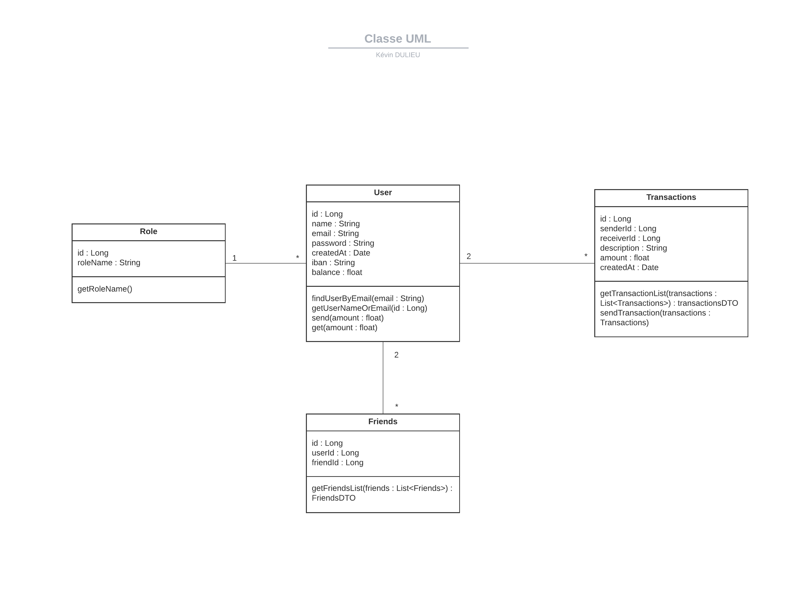
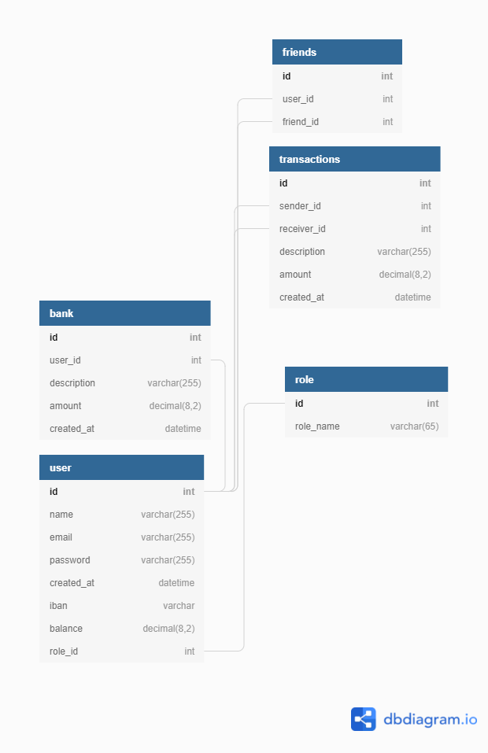

# Pay my Buddy #

Pay my Buddy est une appli qui permettrait aux clients de transférer de l'argent pour gérer leurs finances ou payer leurs amis.

# Diagramme de classe #

# Modèle physique de données #

# initialize and Login to application #

##### Create Mysql Database

To create the database, use the [SQL Script](sql/PayMyBuddyDB.sql).

When the PayMyBuddy database is initialized, you can import the [Dummy Values](sql/dummy_values.sql) to see the application in real condition.

_All dummy users have 'test' as their password_

##### Login in admin
You can use the user with username  'admin@gmail.com' and password
'admin' to connect as a super user with 'ADMIN' authorizations.